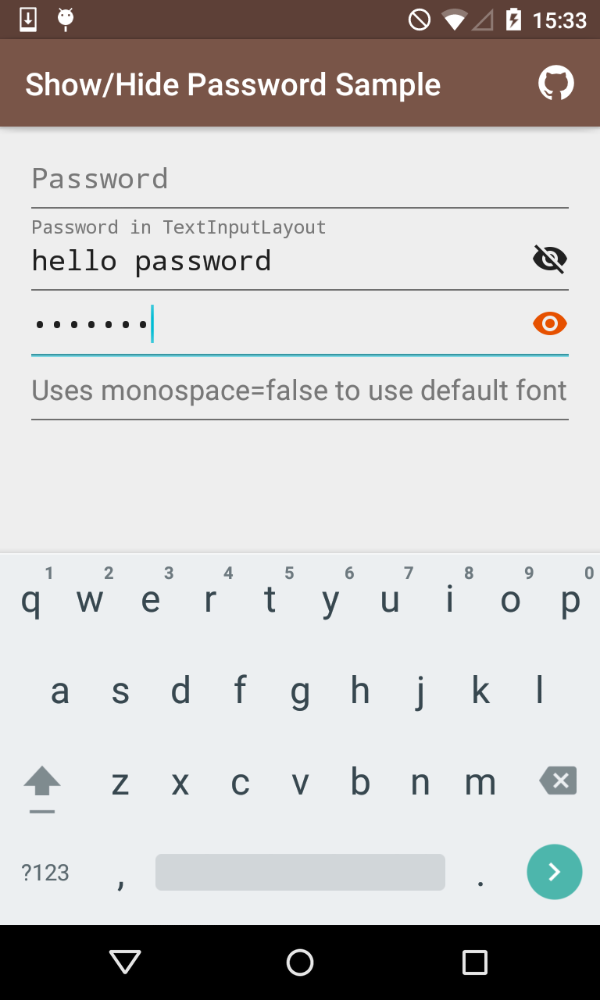

#Show/Hide Password EditText 

Inputting text on mobile devices with their smaller keyboards can be error prone and when the password is obscured it can lead to failed login attempts that can frustrate users. 
Show/Hide Password EditText is a very simple extension of Android's EditText that puts a clickable hide/show icon in the right hand side of the EditText that allows showing of the password. Can be used with `TextInputLayout` from the design support lib.   




## How to use

It's just like the regular EditText.

```xml
 <com.scottyab.showhidepasswordedittext.ShowHidePasswordEditText
            android:layout_width="match_parent"
            android:layout_height="wrap_content"
            android:id="@+id/simplePassword"
            android:hint="Password"
            />
```            


## Add as dependency
This library is not yet released in Maven Central, until then you can add as a library module or use JitPack.io

add remote maven url

```groovy

    repositories {
        maven {
            url "https://jitpack.io"
        }
    }
```
    
then add a library dependency

```groovy
    dependencies {
        compile 'com.github.scottyab:showhidepasswordedittext:0.1'
    }
```

## Customise
            
Customise the hide/show icons via `app:drawable_show="@drawable/ic_custom_show"` and `app:drawable_hide="@drawable/ic_custom_hide"`
  

##Licence 

	Copyright (c) 2015 Scott Alexander-Bown
    
    Licensed under the Apache License, Version 2.0 (the "License");
    you may not use this file except in compliance with the License.
    You may obtain a copy of the License at
    
    http://www.apache.org/licenses/LICENSE-2.0

    Unless required by applicable law or agreed to in writing, software
    distributed under the License is distributed on an "AS IS" BASIS,
    WITHOUT WARRANTIES OR CONDITIONS OF ANY KIND, either express or implied.
    See the License for the specific language governing permissions and
    limitations under the License.